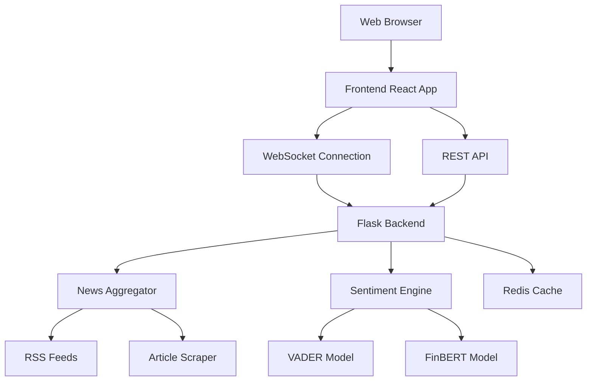

# Gold Sentiment Website Design Document

## Overview

The Gold Sentiment Website is a modern web application that provides real-time market sentiment analysis for gold investments. The system combines news aggregation, AI-powered sentiment analysis, and an intuitive web interface to deliver actionable market insights.

The application follows a client-server architecture with a Python Flask backend handling the heavy computational work (news scraping, AI model inference) and a responsive frontend providing real-time updates through WebSocket connections.

## Architecture

### High-Level Architecture



### Technology Stack

**Backend:**
- Python Flask for web server and API endpoints
- Flask-SocketIO for real-time WebSocket communication
- Redis for caching analysis results and session management
- Celery for background task processing (optional for scaling)

**Frontend:**
- React.js for dynamic user interface
- Socket.IO client for real-time updates
- Chart.js or D3.js for data visualization
- Tailwind CSS for responsive styling

**AI/ML Components:**
- Existing VADER and FinBERT models from the analysis scripts
- Trafilatura for intelligent content extraction
- Concurrent processing for parallel article analysis

## Components and Interfaces

### Backend Components

#### 1. News Aggregator Service
```python
class NewsAggregator:
    def fetch_articles(queries: List[str]) -> List[Article]
    def resolve_google_urls(urls: List[str]) -> List[str]
    def extract_content(url: str) -> str
    def deduplicate_articles(articles: List[Article]) -> List[Article]
```

#### 2. Sentiment Analysis Engine
```python
class SentimentEngine:
    def analyze_headline(text: str) -> HeadlineSentiment
    def analyze_content(text: str) -> ContentSentiment
    def calculate_market_signal(sentiments: List[Sentiment]) -> MarketSignal
    def generate_report(articles: List[AnalyzedArticle]) -> AnalysisReport
```

#### 3. WebSocket Event Handler
```python
class AnalysisSocketHandler:
    def on_start_analysis(data: dict) -> None
    def emit_progress_update(progress: int, message: str) -> None
    def emit_analysis_complete(report: AnalysisReport) -> None
    def emit_error(error: str) -> None
```

#### 4. REST API Endpoints
```
GET  /api/health              - System health check
POST /api/analysis/start      - Trigger new analysis
GET  /api/analysis/latest     - Get cached latest results
GET  /api/analysis/history    - Get historical analysis data
```

### Frontend Components

#### 1. Analysis Dashboard
- Real-time progress indicators
- Market signal display (Bullish/Bearish/Neutral)
- Sentiment distribution charts
- Summary statistics

#### 2. Article List Component
- Expandable article cards
- Sentiment indicators per article
- Source links and metadata
- Filtering and sorting options

#### 3. Control Panel
- Start analysis button
- Configuration options (queries, article limits)
- Export/share functionality

## Data Models

### Article Model
```python
@dataclass
class Article:
    title: str
    url: str
    published: str
    content: str
    source_type: str  # "Full Article" or "Headline Only"
```

### Sentiment Analysis Results
```python
@dataclass
class HeadlineSentiment:
    score: float
    label: str  # "Positive", "Negative", "Neutral"

@dataclass
class ContentSentiment:
    confidence: float
    label: str
    probabilities: Dict[str, float]

@dataclass
class AnalyzedArticle:
    article: Article
    headline_sentiment: HeadlineSentiment
    content_sentiment: ContentSentiment
```

### Analysis Report
```python
@dataclass
class AnalysisReport:
    timestamp: datetime
    total_articles: int
    sentiment_distribution: Dict[str, int]
    net_sentiment_score: float
    market_signal: str  # "BULLISH", "BEARISH", "NEUTRAL"
    articles: List[AnalyzedArticle]
    processing_time: float
```

## Correctness Properties

*A property is a characteristic or behavior that should hold true across all valid executions of a system-essentially, a formal statement about what the system should do. Properties serve as the bridge between human-readable specifications and machine-verifiable correctness guarantees.*

### Property Reflection

After reviewing all identified testable properties, several can be consolidated to eliminate redundancy:

- Properties 3.1 and 3.2 (VADER for headlines, FinBERT for content) can be combined into one comprehensive property about correct model usage
- Properties 4.1, 4.2, and 4.3 (display requirements) can be combined into one property about complete result presentation
- Properties 6.1, 6.3, and 6.4 (error handling) can be combined into one comprehensive error handling property

**Property 1: Analysis request triggers article fetching**
*For any* analysis request, the system should fetch articles from all configured gold-related search queries and display progress updates
**Validates: Requirements 1.2, 2.1**

**Property 2: Analysis completion within time limit**
*For any* analysis request, the system should complete and present results within 60 seconds
**Validates: Requirements 1.3**

**Property 3: Google News URL resolution**
*For any* Google News redirect URL, the system should resolve it to the actual publisher URL
**Validates: Requirements 2.2**

**Property 4: Content extraction with fallback**
*For any* article URL, the system should extract meaningful content or fallback to headline analysis when extraction fails
**Validates: Requirements 2.3, 2.4**

**Property 5: Article deduplication**
*For any* set of articles containing duplicates, the system should filter them to ensure only unique articles remain
**Validates: Requirements 2.5**

**Property 6: Correct sentiment model usage**
*For any* article, the system should use VADER for headline analysis and FinBERT for content analysis
**Validates: Requirements 3.1, 3.2**

**Property 7: Confidence score generation**
*For any* sentiment prediction, the system should provide numerical confidence values between 0 and 1
**Validates: Requirements 3.3**

**Property 8: Weighted market signal calculation**
*For any* set of analyzed articles, the market signal should be calculated using confidence-weighted scoring where higher confidence predictions have greater influence
**Validates: Requirements 3.4**

**Property 9: Text truncation handling**
*For any* text input exceeding model limits, the system should truncate it appropriately without losing essential meaning
**Validates: Requirements 3.5**

**Property 10: Complete result presentation**
*For any* analysis report, the display should include sentiment distribution percentages, individual article details (title, sentiment, confidence, source), and clear market signal indicators
**Validates: Requirements 4.1, 4.2, 4.3**

**Property 11: Real-time progress updates**
*For any* analysis in progress, the system should emit progress updates showing current processing status
**Validates: Requirements 4.4**

**Property 12: Responsive layout adaptation**
*For any* screen size or device type, the system should display properly formatted responsive layouts
**Validates: Requirements 5.1**

**Property 13: Concurrent request handling**
*For any* number of simultaneous users, the system should handle concurrent requests without degradation or failure
**Validates: Requirements 5.2**

**Property 14: Timeout and error handling**
*For any* network request or system operation, appropriate timeouts should be enforced and user-friendly error messages should be displayed when issues occur
**Validates: Requirements 5.3, 5.4**

**Property 15: Result caching**
*For any* completed analysis, results should be cached and retrievable for improved performance on subsequent requests
**Validates: Requirements 5.5**

**Property 16: Graceful error handling**
*For any* system error (network failures, invalid URLs, model issues, resource constraints), the system should handle them gracefully, log appropriately, and continue processing other items
**Validates: Requirements 6.1, 6.2, 6.3, 6.4, 6.5**

## Error Handling

### Network Error Handling
- Implement retry logic with exponential backoff for failed requests
- Set appropriate timeouts for all HTTP requests (10 seconds default)
- Gracefully skip articles that fail to download after retries
- Log all network errors with sufficient detail for debugging

### AI Model Error Handling
- Implement fallback sentiment analysis using simpler methods if FinBERT fails
- Handle CUDA/GPU memory issues by falling back to CPU processing
- Validate model inputs and outputs to prevent crashes
- Provide default neutral sentiment if all analysis methods fail

### Data Validation
- Validate RSS feed responses before processing
- Check article content length and quality before analysis
- Sanitize URLs and handle malformed links
- Implement input validation for all user-provided parameters

### System Resource Management
- Limit concurrent article processing to prevent resource exhaustion
- Implement circuit breakers for external service calls
- Monitor memory usage during AI model inference
- Provide graceful degradation when system resources are low

## Testing Strategy

### Unit Testing Approach
The system will use pytest for unit testing, focusing on:
- Individual component functionality (NewsAggregator, SentimentEngine)
- API endpoint responses and error handling
- Data model validation and serialization
- Utility functions for URL resolution and content extraction

Unit tests will cover specific examples and edge cases, including:
- Empty RSS feeds and malformed XML responses
- Invalid URLs and network timeouts
- AI model edge cases (empty text, very long content)
- WebSocket connection handling and message formatting

### Property-Based Testing Approach
The system will use Hypothesis for property-based testing to verify universal properties across all inputs. Each property-based test will run a minimum of 100 iterations to ensure thorough coverage.

Property-based tests will be tagged with comments explicitly referencing the correctness properties from this design document using the format: **Feature: gold-sentiment-website, Property {number}: {property_text}**

Key property-based tests will include:
- URL resolution works for any valid Google News URL format
- Sentiment analysis produces valid confidence scores for any text input
- Market signal calculation is consistent for any set of sentiment results
- Error handling works gracefully for any type of system failure
- Caching behavior is correct for any analysis result

### Integration Testing
- End-to-end testing of the complete analysis pipeline
- WebSocket communication testing with real browser clients
- Performance testing under various load conditions
- Cross-browser compatibility testing for the frontend

### Testing Framework Configuration
- **Unit Testing**: pytest with coverage reporting
- **Property-Based Testing**: Hypothesis with custom generators for articles, URLs, and sentiment data
- **Frontend Testing**: Jest and React Testing Library for component testing
- **Integration Testing**: Selenium for end-to-end browser testing
- **Performance Testing**: Locust for load testing the API endpoints

Both unit tests and property-based tests are essential and complementary - unit tests catch specific bugs and verify concrete examples, while property-based tests verify general correctness across the entire input space.